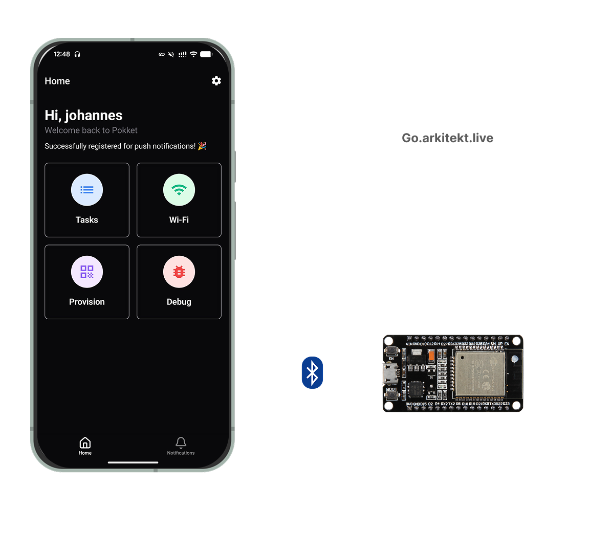

# Pokket



**Pokket** is your mobile gateway to the [Arkitekt](https://arkitekt.live) ecosystem. It serves as a companion app for managing your Arkitekt services, tasks, and connected devices directly from your phone.

## Features

### 🔗 Arkitekt Connection

Seamlessly connect to your Arkitekt instance. Pokket handles authentication via `lok` and provides a secure connection to your services.

### 📋 Task Management

Stay on top of your workflows. View and manage your latest tasks through the `rekuest` service integration, ensuring you never miss an important action.

### 📡 Device Provisioning

Easily provision ESP32-based devices for your lab or home. Pokket uses the **Improv Wi-Fi** protocol over BLE to configure devices with:

- Wi-Fi Credentials (Standard & Eduroam support)
- Arkitekt Connection Tokens

### 📶 Wi-Fi Profile Management

Manage your Wi-Fi configurations in one place. Save standard and Eduroam profiles to quickly provision multiple devices without re-entering credentials.

### 🕸️ Organisation Mesh

Deployments that run an organisation mesh (an [ionscale](https://github.com/jsiebens/ionscale)
tailnet, advertised as `mesh_coord_url` in `.well-known/fakts`) can let pokket in when you
approve it. Pokket then runs its own in-app Tailscale node — no VPN permission, no Tailscale app
— and reaches the services that only live on the mesh through it. The **Mesh** screen shows the
node, the machines it sees, which services it carries, and lets you switch it off.

## Get Started

Currently available for Android devices with BLE support. Just download the APK from the [Releases](https://github.com/jhnnsrs/pokket/releases) page and install it on your device.

## Devlopment Setup

1. **Install dependencies**

   This project uses [pnpm](https://pnpm.io). If you don't have it,
   `corepack enable` picks up the version pinned in `package.json`.

   ```bash
   pnpm install
   ```

2. **Start the app**

   ```bash
   pnpm expo start
   ```

3. **Build the mesh sidecar (optional)**

   The mesh is a Go library ([tsnet](https://tailscale.com/kb/1244/tsnet)) bound into the
   local Expo module `modules/pokket-mesh` with gomobile. Without it the app builds and runs,
   and simply has no mesh. To include it, build it before any native build (`expo prebuild`,
   `expo run:android`, `eas build --local`):

   ```bash
   pnpm build:mesh:android   # needs Go and the Android NDK (ANDROID_NDK_HOME)
   pnpm build:mesh:ios       # needs Go and Xcode, on macOS
   ```

   The outputs are gitignored but listed as kept in `.easignore`, so EAS builds pick them up.

   How it works: for every alias on the mesh, the node opens a reverse proxy on
   `127.0.0.1:<port>` that replays requests (and WebSocket upgrades) to the alias over the
   tailnet, with the alias' own Host header and TLS. Service clients are built against that
   loopback address; everything else goes directly. WebRTC media (LiveKit) is not carried.
   The node keeps its identity in the app's files, so it rejoins by itself after the one-shot
   key from the login has been used.

   **Permissions.** The mesh needs no VPN permission and no runtime prompt on Android: it uses
   `INTERNET` and `ACCESS_NETWORK_STATE` (install-time), and cleartext HTTP is allowed app-wide in
   release builds (the loopback proxies and plain-HTTP LAN aliases need it; see
   `modules/pokket-mesh/app.plugin.js`). On iOS the node's search for direct paths to peers on the
   LAN can show the Local Network prompt, with the text set in the same plugin. The node never
   sends logs to Tailscale.

   **Working on it in a development build.** Expo Go has no mesh (it cannot load the native
   module); use a development build, which has it once the library is built:

   ```bash
   pnpm build:mesh:android && npx expo run:android   # or: pnpm build:mesh:ios && npx expo run:ios
   # or, after pnpm build:mesh: eas build --profile development
   # or skip the local build: run the "Dev client" workflow in GitHub Actions
   # and install its artifact (Android APK / iOS simulator .app)
   pnpm expo start --dev-client                      # then iterate on the JS as usual
   ```

   Only the Go code needs a native rebuild; the Mesh screen, `lib/mesh` and the fakts client
   reload like any other JS. A reload keeps the running nodes: the new JS reattaches to them, and
   the aliases keep their loopback ports. To see the mesh work without a deployment,
   `pnpm mesh:tailnet` serves a throwaway tailnet on your machine and prints a
   `pokket://mesh-selftest?...` link; open it in the dev build (same network) and it joins,
   fetches and holds a WebSocket through the mesh, and reports the result in your terminal.

4. **Tests**

   ```bash
   pnpm test                                   # jest: fakts client, lib/mesh
   (cd modules/pokket-mesh/go && go test ./...) # Go, incl. a real in-process tailnet
   ```

   The `Mesh sidecar` workflow additionally builds the app for Android and the iOS simulator, both
   as release builds and as development builds loading their JS from Metro, and runs each on an
   emulator/simulator against a test tailnet (`TestDeviceEnv`): the app is sent
   `pokket://mesh-selftest?...` (active in development builds, and in release builds made with
   `EXPO_PUBLIC_MESH_SELFTEST=1`), joins, and must fetch and hold a WebSocket through the mesh,
   reporting back through it. The run also fails if the deep links it sends do not reach the
   app's JS.

## Tech Stack

- **Framework**: React Native (Expo)
- **Styling**: NativeWind (Tailwind CSS)
- **Navigation**: Expo Router
- **Data**: Apollo Client (GraphQL)
- **BLE**: `react-native-ble-plx`

## License

MIT (see [LICENSE](LICENSE))
